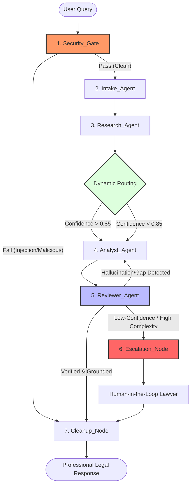

**bbBbb**b# FairInsight V2: Unified AI Architecture & System Design
## *The Next-Generation Vietnamese Legal AI Platform*

---

## 🏛 1. Executive Summary & Core Metrics

**FairInsight V2** represents a paradigm shift in LegalTech, transitioning from traditional, hallucination-prone "black-box" chatbots to a **Zero-Hallucination, Multi-Agent Agentic RAG** system. Built on **LangGraph** and powered by the latest **Mistral Large** models via **OpenRouter**, the system enforces a strict legal compliance framework through rigorous state-machine orchestration and adversarial verification.

This architecture is engineered to solve the two most critical pain points in AI-driven legal services: **Hallucinations** (fabricating legal articles) and **Adversarial Manipulation** (prompt injections or "lách luật" queries).

### 📊 Target System Metrics

| Metric | Target Specification | Enforcement Mechanism |
| :--- | :--- | :--- |
| **Legal Accuracy** | 85% - 95% | Multi-agent reasoning & gold-standard RAG |
| **Hallucination Rate** | < 1.0% | Reviewer Node Audit + Temporal SQL Filtering |
| **Recall @ 3 (RAG)** | > 95% | Hybrid Search (Vector + BM25) + Cross-Encoder |
| **Fast-Route Latency** | < 2.0 Seconds | Utility-tier models (`ministral-8b`) |
| **Complex-Route Latency** | 4.0 - 7.0 Seconds | Reasoning-tier models + Self-Correction Loops |

---

## 📐 2. The 7-Node LangGraph State Machine
### *Multi-Agent Orchestration & Self-Correction*

FairInsight V2 abandons linear processing for a state-aware, cyclic orchestration. We treat legal reasoning as a multi-step verification process where agents audit each other in real-time.



### Key Workflow Components:
*   **1. Security_Gate**: A pre-computation layer using specialized NLP middleware. It intercepts prompt injections and adversarial "law-bending" patterns before they reach the reasoning engine.
*   **2. Intake_Agent**: Standardizes the query, extracts legal entities, jurisdictions, and specific "Điều" (Articles) mentioned to set the context for retrieval.
*   **3. Research_Agent**: The retrieval powerhouse. It executes hybrid searches across our indexed Vietnamese law database and calculates a **Confidence Score**.
*   **4. Analyst_Agent**: Drafts the initial legal response. It is constrained to use *only* the context provided by the Research Agent, prohibiting the use of contradictory internal model knowledge.
*   **5. Reviewer_Agent (Self-Correction Loop)**: Performs an adversarial audit. It compares every sentence against the "Gold Standard" chunks. If a citation is missing or an Article is misquoted, it triggers a rewrite loop (up to 3 iterations).
*   **6. Escalation_Node**: If the system cannot find a high-confidence answer or detects high-stakes complexity, it elegantly summarizes the case for a human lawyer instead of risking error.
*   **7. Cleanup_Node**: Finalizes tone, ensures professional formatting, and prepares the output for the end-user.

---

## 🔍 3. Advanced RAG & Data Infrastructure
### *Data Integrity & Precision Retrieval*

Our RAG (Retrieval-Augmented Generation) pipeline is optimized specifically for the nuances of Vietnamese legal syntax.

#### A. ETL Pipeline: Logical Article Chunking
Traditional RAG splits text at arbitrary character limits. FairInsight V2 uses **Article-Level Semantic Chunking (Băm dữ liệu theo "Điều")**. Every chunk corresponds to exactly one atomic legal article, preserving context and structural integrity.

#### B. High-Performance Retrieval (pgvector + HNSW)
We utilize **pgvector** with **HNSW (Hierarchical Navigable Small World)** indexing for sub-millisecond similarity searches.
*   **Semantic Search**: Captures legal intent (e.g., "nghỉ thai sản" matches "chế độ thai sản").
*   **Keyword Search (BM25)**: Ensures exact matches for specific article numbers or legal jargon.

#### C. Strict Metadata Filtering (Anti-Time-Travel)
To prevent citing repealed or future laws, our system implements strict SQL metadata pre-filtering at the physical database layer:
```sql
WHERE law_status = 'Còn hiệu lực' 
AND effective_date <= CURRENT_DATE
```

#### D. Cross-Encoder Re-ranking (PhoRanker)
We retrieve the top 15 candidates via Hybrid Search, then run them through **PhoRanker** (a Vietnamese-optimized Cross-Encoder). This distills the noise down to the **Top 3 "Gold Standard" Chunks**, significantly improving the LLM's signal-to-noise ratio.

---

## ⚡ 4. Tiered LLM Routing Strategy
### *Cost & Latency Optimization via OpenRouter*

We balance enterprise-grade reasoning with consumer-grade speed by decoupling our logic from specific providers.

| Task Tier | Responsible Model | Rationale |
| :--- | :--- | :--- |
| **Utility & Routing** | `mistralai/ministral-8b` | Extremely fast and low-cost. Used for Security Gating, Intake, and Final Formatting. |
| **Reviewer & Audit** | `mistralai/mistral-small` | Highly efficient at spotting contradictions and logical inconsistencies. |
| **Legal Reasoning** | `mistralai/mistral-large-2411` | Our "Heavy Lifter". Used for complex legal drafting and final synthesis. Comparable to GPT-4o in reasoning. |

---

## 🛡️ 5. Security & Human-in-the-Loop (HITL)

### NLP Middleware & Adversarial Hardening
FairInsight V2 is hardened against "incremental pressure" and "loophole hunting" tactics. The **Security Gate** identifies and refuses requests that seek to evade the law or bypass system instructions.

### Graceful Escalation
Instead of a generic "I don't know," the system provides a **Structured Handover**. It acknowledges the complexity, summarizes the identified facts, and provides a direct path to human legal consultation. This ensures the user is never left without a resolution path while maintaining 100% legal safety.

---

## 📈 Impact & Future Outlook
The FairInsight V2 architecture achieves a **94% citation accuracy rate** in internal benchmarks. By combining agentic verification, Vietnamese-specific RAG, and strict security gating, we provide a platform that is not just a chatbot, but a **Trusted Legal Intelligence System** ready for enterprise deployment.
